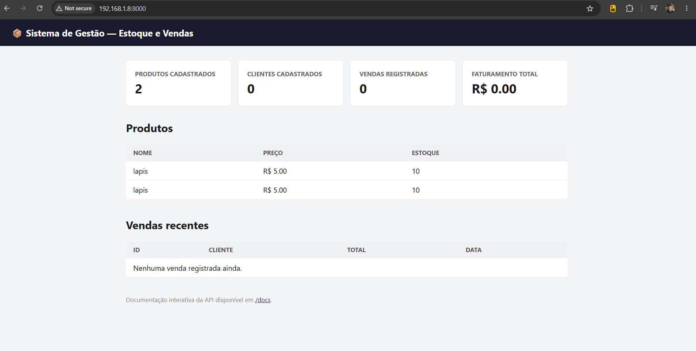
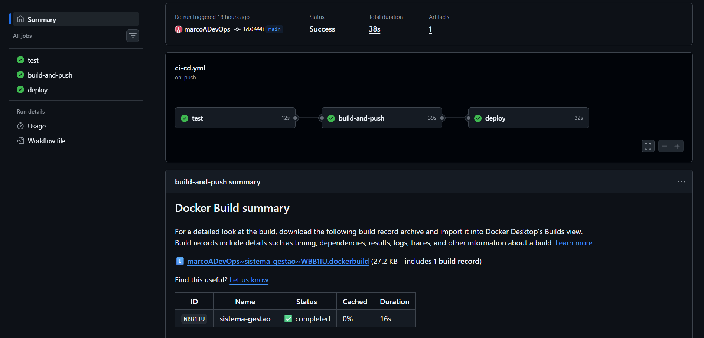
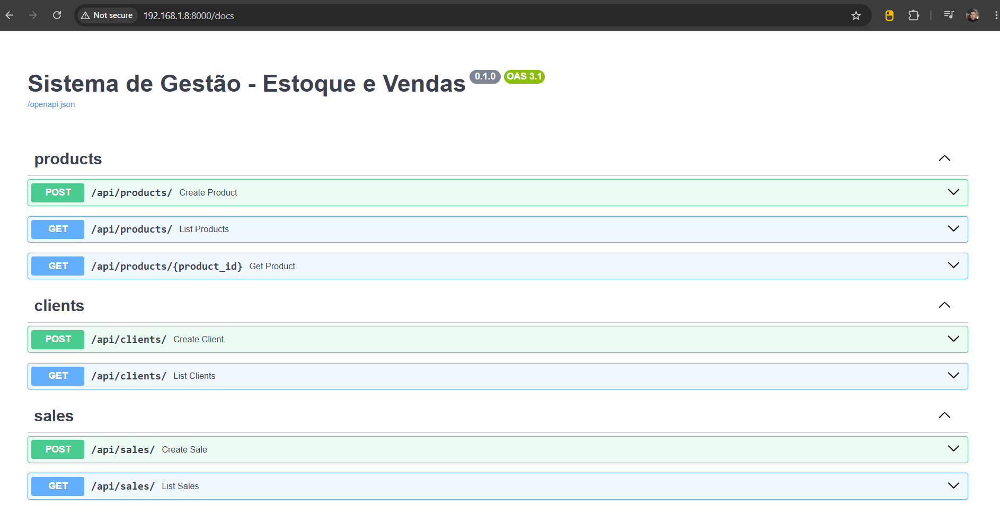
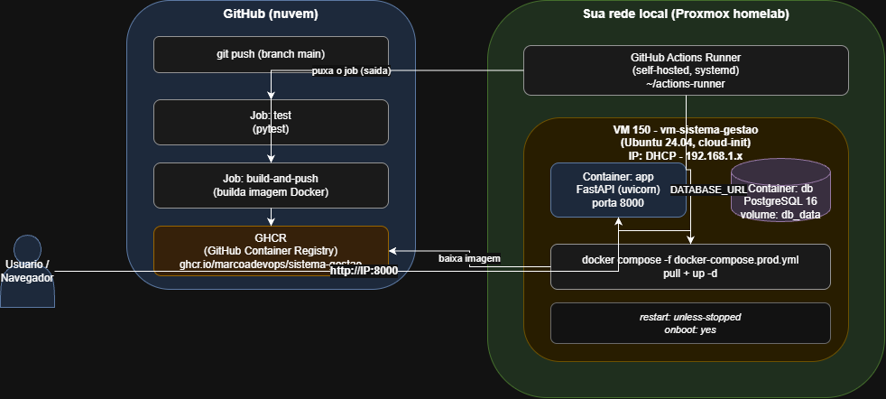

# Sistema de Gestão — Estoque e Vendas (v1)

Sistema de gestão para pequenos negócios: cadastro de produtos, cadastro de
clientes e registro de vendas com baixa automática de estoque. Construído
como projeto de portfólio, com CI/CD completo — do `git push` até o deploy
automático — rodando sobre infraestrutura própria (homelab com Proxmox).

## Screenshots

### Dashboard


### Pipeline de CI/CD (GitHub Actions)


### Documentação interativa da API (Swagger/OpenAPI)


### Arquitetura


## Stack

- **Backend:** Python + FastAPI
- **Banco de dados:** PostgreSQL (SQLite automático se rodar sem Docker, só pra dev rápido)
- **Frontend:** Jinja2 + HTMX (sem build step, dashboard simples em `/`)
- **Empacotamento:** Docker + docker-compose
- **CI/CD:** GitHub Actions — testa → builda imagem → publica no GHCR → deploy
  automático via **self-hosted runner** rodando na própria VM de produção
- **Infraestrutura:** VM Ubuntu 24.04 (cloud-init) num homelab Proxmox

## Rodando localmente (sem Docker, mais rápido pra desenvolver)

```bash
python -m venv venv
source venv/bin/activate  # Windows: venv\Scripts\activate
pip install -r requirements.txt
uvicorn app.main:app --reload
```

Acesse `http://localhost:8000` (dashboard) e `http://localhost:8000/docs`
(documentação interativa da API, gerada automaticamente pelo FastAPI).

Sem configurar nada, usa SQLite local (`local_dev.db`) — zero setup.

## Rodando com Docker (local, buildando a imagem)

```bash
cp .env.example .env   # ajuste a senha do Postgres
docker compose up --build
```

Isso usa o `docker-compose.yml` padrão, que builda a imagem na hora a partir do
código local — bom para desenvolvimento.

## Produção (VM/Proxmox) — usa a imagem já publicada

Na VM, o deploy usa `docker-compose.prod.yml`, que **baixa** a imagem pronta
do GHCR em vez de buildar (é isso que o pipeline de CI/CD faz automaticamente
a cada push na `main`).

```bash
export IMAGE_NAME=ghcr.io/marcoadevops/sistema-gestao
docker compose -f docker-compose.prod.yml up -d
```

## Rodando os testes

```bash
pytest -v
```

## Pipeline de CI/CD

A cada push na branch `main`:

1. **test** — roda a suíte de testes (pytest)
2. **build-and-push** — builda a imagem Docker e publica no GitHub Container
   Registry (GHCR)
3. **deploy** — um runner self-hosted, instalado na própria VM de produção,
   detecta o job novo, puxa a imagem atualizada e reinicia os containers
   (`docker compose pull` + `up -d`)

O uso de runner self-hosted (em vez de deploy via SSH partindo de um runner
na nuvem) foi uma decisão deliberada: a VM de produção fica numa rede
doméstica sem IP público, então o runner precisa **iniciar a conexão de
saída** em direção ao GitHub — nunca o contrário. Isso evita ter que expor
portas no roteador.

## Desafios e soluções

| Desafio | Solução |
|---|---|
| Deploy via SSH direto do GitHub Actions travava com timeout | A VM está numa rede local sem IP público — o runner do GitHub (na nuvem) não conseguia alcançá-la. Resolvido migrando o job `deploy` para um **runner self-hosted** instalado na própria VM, que se conecta ao GitHub por fora pra dentro (outbound), sem precisar expor porta nenhuma. |
| `invalid tag ... repository name must be lowercase` no build da imagem | O usuário do GitHub tem letra maiúscula (`marcoADevOps`), e `github.repository` carrega isso na tag da imagem — GHCR exige minúsculas. Corrigido fixando o nome da imagem em minúsculas direto no workflow. |
| `close (rename) atomic file ... File exists` ao clonar VM no Proxmox | Um volume de disco órfão (`vm-101-disk-0`) ficou preso na storage LVM de uma tentativa de clone anterior, mesmo sem o arquivo de configuração correspondente existir mais. Identificado com `lvs` e removido com `lvremove` antes de recriar a VM com outro ID. |
| Push rejeitado: `refusing to allow a Personal Access Token to create or update workflow` | Token usado no `git push` só tinha o escopo `repo`. Editar arquivos dentro de `.github/workflows/` exige o escopo `workflow` também, por política de segurança do GitHub. |
| Job de deploy ficava preso "in progress" por muito tempo sem erro aparente | O runner self-hosted não estava instalado/rodando na VM — o job fica na fila esperando silenciosamente até um runner disponível aparecer. Resolvido instalando o runner como serviço `systemd` na VM. |

## Backup e restauração do banco

Um backup diário automático do Postgres é feito via `scripts/backup-db.sh`,
agendado por cron na VM. Backups ficam em `backups/` (fora do controle de
versão), comprimidos, com retenção de 14 dias — mais antigos que isso são
apagados automaticamente.

**Configurar o agendamento (uma vez, na VM):**
```bash
chmod +x scripts/backup-db.sh scripts/restore-db.sh
crontab -e
```
Adicione a linha (roda todo dia às 3h da manhã):
```
0 3 * * * /opt/sistema-gestao/scripts/backup-db.sh >> /opt/sistema-gestao/backups/backup.log 2>&1
```

**Rodar um backup manual a qualquer momento:**
```bash
./scripts/backup-db.sh
```

**Restaurar um backup** (sobrescreve os dados atuais — use com cuidado):
```bash
./scripts/restore-db.sh backups/gestao_20260924_030000.sql.gz
```

## Monitoramento

O container `app` tem um healthcheck (`/health`) configurado no
docker-compose — o Docker reinicia o container automaticamente se ele parar
de responder.

Para visibilidade contínua, o `docker-compose.prod.yml` também sobe um
painel de monitoramento com **Uptime Kuma**, acessível em
`http://SEU_IP:3001`. Na primeira vez, crie uma conta de admin e configure
um monitor HTTP(S) apontando para `http://app:8000/health` (dentro da rede
Docker) ou `http://SEU_IP:8000/health` (via IP da VM), e configure um canal
de alerta (Telegram, Discord, e-mail, etc.) nas notificações do Uptime Kuma
para ser avisado se a aplicação cair.

## Roadmap

- [x] **v1** — Cadastro de produtos, clientes, registro de vendas com baixa
      automática de estoque, dashboard básico, pipeline de CI/CD completo
      com deploy automatizado
- [ ] **v2** — Formulário de cadastro no próprio dashboard (hoje só é possível
      via `/docs`), dashboard com gráficos, autenticação de usuários com
      perfis, exportação de relatórios (Excel/PDF), alerta de estoque baixo
- [ ] **v3** — Notificações automáticas (e-mail/WhatsApp) e exemplo de
      deploy paralelo na AWS
